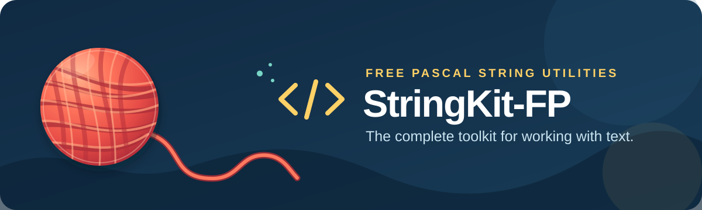

<p align="center">
  
</p>

# StringKit-FP

[](https://www.freepascal.org/)
[](https://www.lazarus-ide.org/)
[](LICENSE.md)
[](https://github.com/ikelaiah/stringkit-fp/actions/workflows/ci.yml)
[](https://github.com/ikelaiah/stringkit-fp/releases/tag/v1.9.1)

Practical string handling for Free Pascal and Lazarus: cleaning, identifier case conversion, validation, encoding, regex extraction, approximate matching, and readability helpers. It has no third-party runtime dependencies.

## Learn StringKit-FP

- [Beginner Guide](docs/start/beginner-guide.md) — installation and the first useful calls.
- [Recipes](docs/start/recipes.md) — complete, compiled programs with expected output.
- [Cheat Sheet](docs/start/cheat-sheet.md) — compact API reminder.
- [API Overview](docs/reference/api-overview.md) — find the right area quickly.
- [Online documentation](https://ikelaiah.github.io/stringkit-fp/1.9.1/) — browsable, versioned HTML documentation.

The repository [documentation index](docs/index.md) links to all beginner guides, topic guides, contracts, and helper references.

## Quick start

Add `src/` to your project’s unit search path, then:

```pascal
program FirstStringKitCall;

{$mode objfpc}{$H+}

uses
  StringKit;

begin
  Writeln(TStringKit.ToSnakeCase('HelloWorld'));
end.
```

Compile from the repository root with:

```text
fpc -Fusrc first_stringkit_call.pas
```

It prints `hello_world`; the same program is checked as [a documentation example](examples/documentation/00_first_stringkit_call.pas).

For Lazarus, open `packages/lazarus/stringkit_fp.lpk`, compile it, then select **Use → Add to Project**. You can instead add `src/` under **Project Options → Compiler Options → Paths → Other Unit Files**.

## Static and helper calls

The static API is the simplest starting point:

```pascal
Clean := TStringKit.Trim(' hello ');
```

Add `StringKitHelper` if you prefer the equivalent helper spelling:

```pascal
Clean := ' hello '.Trim;
```

They use the same implementation. Read [Static API vs helper API](docs/guides/static-vs-helper.md) before opting into selective `SK_*` helper flags.

## Important contracts

- `SubString` uses Pascal 1-based indexing.
- Current classification, case conversion, and encoding behaviour is largely byte/ASCII-oriented, not Unicode grapheme-aware.
- Validators are practical syntax checks, not complete RFC validation or reachability checks.
- `PercentEncode` uses `%20` for spaces; `FormURLEncode` and legacy `URLEncode` use `+`.
- Prefer `TryHexDecode`, `TryDecode64`, and `TryFromRoman` when malformed input is expected.

See [Contracts and limitations](docs/reference/contracts-and-limitations.md) and [Encoding](docs/guides/encoding.md) for the details.

## Verification

On a system with FPC 3.2.2:

```text
python tools/test_docs_examples.py
python tools/build_all_docs.py --site-root build/docs-site
python tools/check_built_docs.py --site build/docs-site
```

The existing library suite is compiled and run by GitHub Actions on Ubuntu and Windows. See [CONTRIBUTING.md](CONTRIBUTING.md) for contribution guidance and [CHANGELOG.md](CHANGELOG.md) for release history.

## License

[MIT](LICENSE.md)
